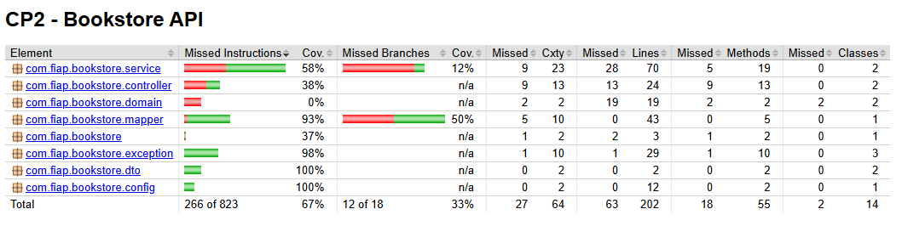

# 📚 Bookstore API


A Bookstore API é uma aplicação desenvolvida em Spring Boot como parte da avaliação CP2 da FIAP.
O sistema oferece um CRUD completo para as entidades Autor e Livro, estabelecendo um relacionamento 1:N entre elas.

O projeto segue princípios modernos de desenvolvimento, aplicando arquitetura MVC, injeção de dependência, e o uso de DTOs baseados em records para representar dados de forma imutável e enxuta.
Conta ainda com um Mapper personalizado para conversão entre entidades e DTOs, um tratamento global de exceções elegante via @ControllerAdvice, e uma suíte de testes unitários e de integração com cobertura JaCoCo.

## 🧠 Tecnologias Utilizadas

☕ Java 17

🌱 Spring Boot 3

🧩 Spring Data JPA

🧰 H2 Database (em memória)

🧭 Springdoc OpenAPI (Swagger UI)

🧪 JUnit 5 & Mockito

📊 JaCoCo (Relatório de Cobertura de Testes)


## ⚙️ Configuração e Execução

### 🪄 Clonar o repositório

```
git clone https://github.com/seuusuario/bookstore-api.git

cd bookstore-api
```
### 🚀 Executar o projeto
```
mvn spring-boot:run
```


## 🧠 Acessar os recursos

| Recurso          | URL                                                                            | Descrição                        |
| ---------------- | ------------------------------------------------------------------------------ | -------------------------------- |
| 🧭 Swagger UI    | [http://localhost:8080/swagger-ui.html](http://localhost:8080/swagger-ui.html) | Interface interativa da API      |
| 🗄️ H2 Console   | [http://localhost:8080/h2-console](http://localhost:8080/h2-console)           | Banco de dados em memória        |
| 📊 JaCoCo Report | `target/site/jacoco/index.html`                                                | Relatório de cobertura de testes |


## 🧩 Credenciais H2 (padrão):

* JDBC URL: 
```
jdbc:h2:mem:bookstore-db
```
* Usuário: sa
* Senha: (em branco)

## 🏗️ Estrutura do Projeto

```
**src/**
├── main/java/com/fiap/bookstore
│ ├── config/ # Configurações da aplicação
│ ├── controller/ # Controladores REST
│ ├── domain/ # Entidades JPA (Autor, Livro)
│ ├── dto/ # DTOs implementados como records
│ ├── exception/ # Exceptions e Handler global
│ ├── mapper/ # Interface e implementação do mapper
│ ├── repository/ # Interfaces Spring Data JPA
│ ├── service/ # Interfaces e implementações de negócio
│ └── BookstoreApiApplication.java # Classe principal
│
├── resources
│ ├── application.properties # Configurações H2 e JPA
│ ├── schema.sql # Criação inicial de tabelas 
│ └── static 
│
└── test/java/com/fiap/bookstore
├── controller/ # Testes de integração
├── service/ # Testes unitários
├── mapper/ # Testes do mapper
└── exception/ # Testes do GlobalExceptionHandler
```

## 🧩 Endpoints da API

📖 Autores

| Método | Endpoint               | Descrição                | Status |
| ------ | ---------------------- | ------------------------ | - |
| GET    | `/autores`             | Lista todos os autores   | ✅ |
| GET    | `/autores/{id}`        | Busca autor por ID       | ✅ |
| POST   | `/autores`             | Cria um novo autor       | ✅ |
| PUT    | `/autores/{id}`        | Atualiza autor existente | ✅ |
| DELETE | `/autores/{id}`        | Remove um autor          | ✅ |
| GET    | `/autores/{id}/livros` | Lista livros de um autor | ✅ |


📚 Livros

| Método | Endpoint       | Descrição                               | Status |
| ------ | -------------- | --------------------------------------- | ------ |
| GET    | `/livros`      | Lista todos os livros                   | ✅      |
| GET    | `/livros/{id}` | Busca livro por ID                      | ✅      |
| POST   | `/livros`      | Cria um novo livro vinculado a um autor | ✅      |
| PUT    | `/livros/{id}` | Atualiza um livro existente             | ✅      |
| DELETE | `/livros/{id}` | Exclui um livro                         | ✅      |


## 🧪 Testes
📘 Executar testes
```
mvn test
```

### 📗 Gerar relatório de cobertura
```
mvn jacoco:report
```

### 📂 O relatório será gerado em:
```
target/site/jacoco/index.html
```

## 📊 Relatório de Cobertura (JaCoCo)

A aplicação atingiu **67% de cobertura total**.  
Os testes incluem **unitários e de integração**, abrangendo services, controllers, mapper e tratamento global de exceções.

<p align="center">
  
</p>


## 🔗 Repositório no GitHub

📎 Acesse o código completo do projeto aqui:  

👉 [https://github.com/alanerochaa/bookstore-api](https://github.com/alanerochaa/bookstore-api)


## 👩‍💻 Autora

✨ **Alane Rocha da Silva**

📘 RM561052

<p align="center">
  Desenvolvido com 💚 e muito ☕ Java.
</p>
